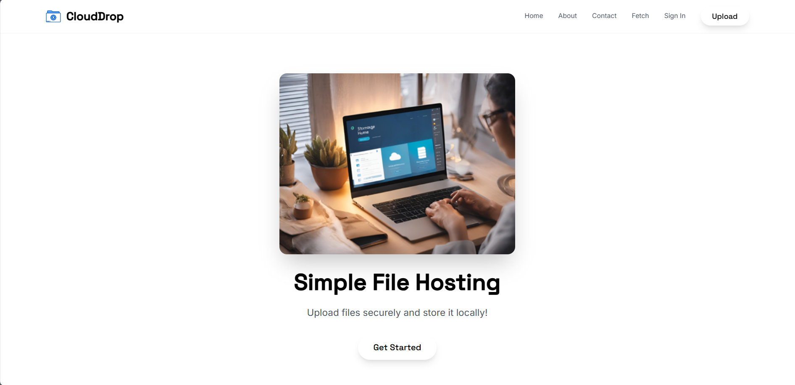
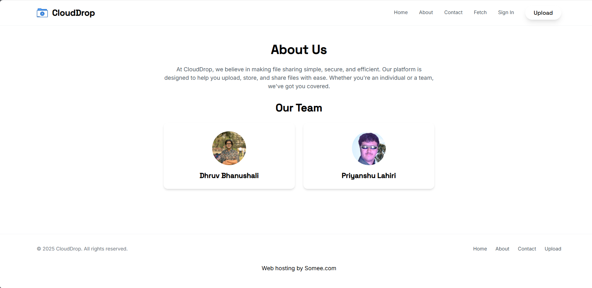
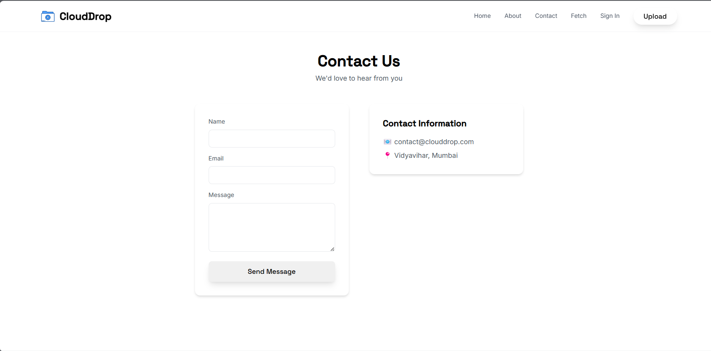
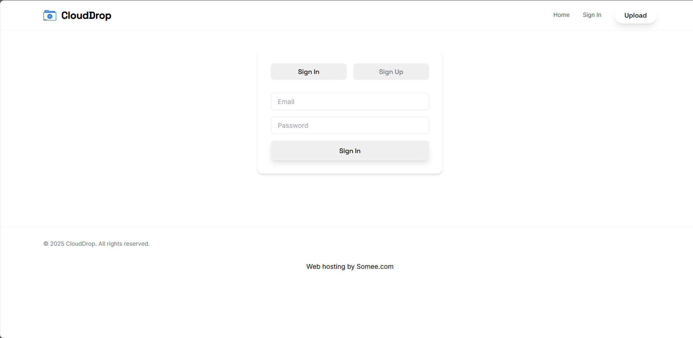
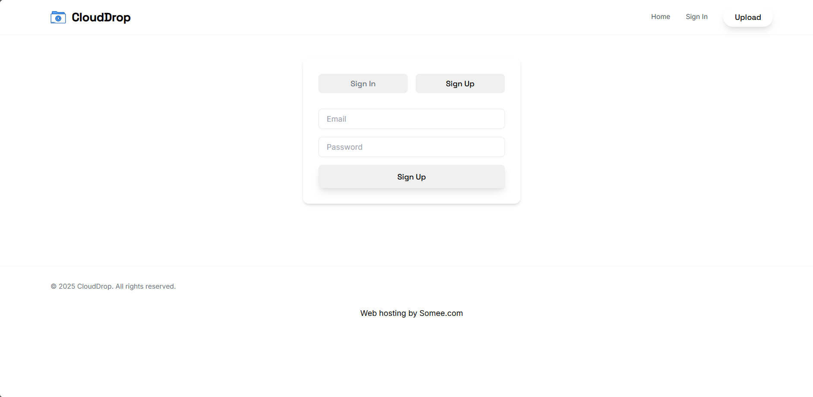
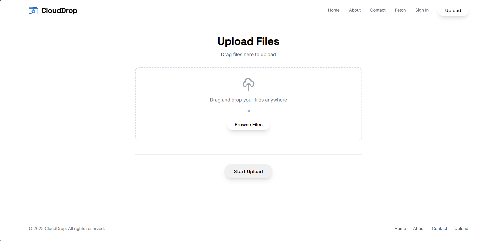
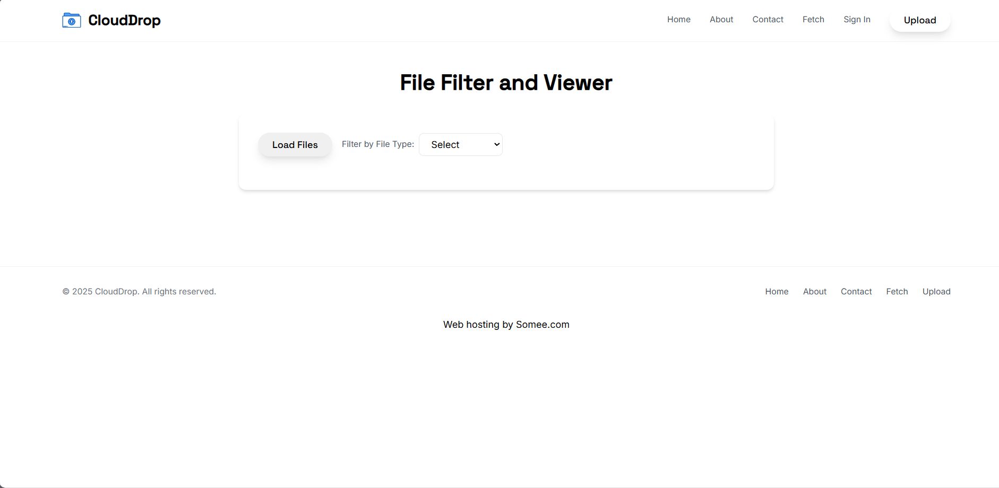

# CloudDrop  

CloudDrop is a file hosting website that allows users to upload files, which are then stored locally in the `uploads` folder of the hosting server. Users can retrieve their files by providing the filename on the Fetch page, which returns a link to the stored file.  

## 🚀 Live Demo  

🔗 **[Click here to try CloudDrop](https://filehosting.somee.com/)**  

## 📸 Screenshots  

| Page        | Screenshot |
|------------|------------|
| Home Page  |  |
| About Page |  |
| Contact Page |  |
| Sign-in Page |  |
| Register Page |  |
| Upload Page |  |
| Fetch Page |  |

## 🎥 Demo Videos  

📌 **Full Upload & Fetch Workflow**  
[](https://www.youtube.com/watch?v=xKuVb4eloYg)  

📌 **Login & Registration Process**  
- [Login Demo](https://www.youtube.com/watch?v=tCpOtitZMFc)  
- [Register Demo](https://www.youtube.com/watch?v=kEXq8A8owto)  

## ✨ Features  

- **Home Page**: Introduction and overview of CloudDrop.  
- **About Page**: Information about the project and its developers.  
- **Contact Page**: Contact form for users to reach out.  
- **Sign-in Page**: User authentication for secure access.  
- **Register Page**: New users can sign up for an account.  
- **Upload Page**: Allows users to upload files to the server.  
- **Fetch Page**: Users can input a filename to retrieve a link to the file stored on the server.  

## 🛠 Technologies Used  

- **HTML**: Structure of the website.  
- **CSS**: Styling the web pages.  
- **JavaScript**: Adding interactivity and dynamic content.  
- **ASP.NET**: Backend framework for handling server-side operations.  
- **Tailwind CSS**: Utility-first CSS framework for rapid UI development.  

## 📦 Installation  

1. Clone the repository:  
   ```bash
   git clone https://github.com/LejhandG/aspx-project-bca.git
   ```  
2. Navigate to the project directory:  
   ```bash
   cd aspx-project-bca
   ```  
3. Set up the project in your preferred ASP.NET environment.  
4. Start the server and navigate to `http://localhost:port` to see the website.  

## 🚀 Usage  

1. **Upload Files**: Go to the Upload page and select a file to upload. The file will be stored in the `uploads` folder on the server.  
2. **Fetch Files**: On the Fetch page, enter the filename to retrieve the file link. You can then download the file from the provided link.  

## 🤝 Contributing  

Contributions are welcome! Please feel free to submit issues, pull requests, or suggest improvements.  

## 📜 License  

This project is licensed under the **MIT License**.  
